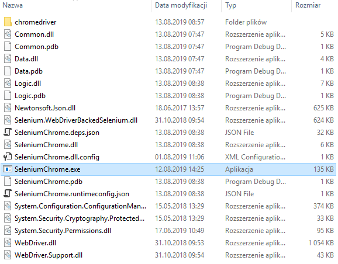
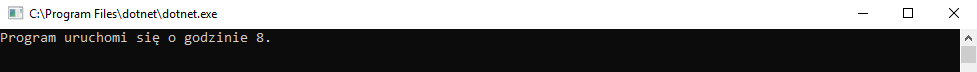
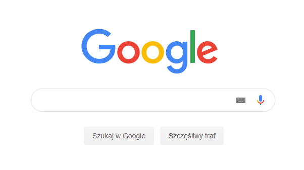
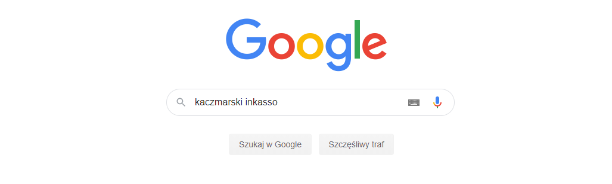
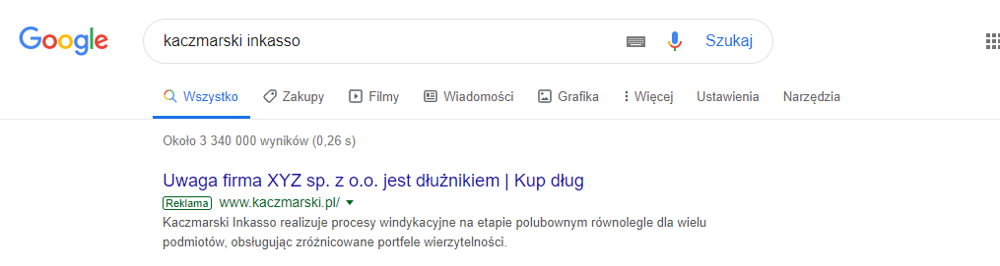

# Antywindykacja

## Spis treści
* [Technologie](#technologie)
* [O programie](#o-programie)
* [Konfiguracja](#konfiguracja)
* [Uruchomienie na Windows](#uruchomienie-na-windows)
* [Uruchomienie na Ubuntu](#uruchomienie-na-ubuntu)
* [Uruchomienie na MacOS](#uruchomienie-na-macos)
* [Działanie programu](#działanie-programu)
* [Licencja](#licencja)

## Technologie
* .NET Core 2.2.150
* Selenium 3.141.0

## O programie
Program został stworzony, aby mógł klikać w reklamy przez określony czas. Aplikacja korzysta z danych, które sami wprowadzimy w pliku konfiguracyjnym (`SeleniumChrome.dll.config`), gdzie podajemy frazę do wyszukania, tytuł reklamy, adresy IP oraz godziny w których program ma działać. Dzięki tym informacjom dana reklama jest wyszukiwana w przeglądarce oraz załadowana. Program działa ciągle w podanych przez nas godzinach.
* Program korzysta z przeglądarki [Google Chrome](https://www.google.com/intl/en/chrome/)
* Program działa prawidłowo tylko dla adresów IP Proxy HTTP

## Konfiguracja
Przed uruchomieniem programu powinniśmy sprawdzić czy jest on dobrze skonfigurowany. Bardzo ważne jest podanie godzin, w których program powinien działać oraz wpisanie odpowiedniej frazy do wyszukania w google i tytułu reklamy.
Wszystko robimy w pliku o nazwie `SeleniumChrome.dll.config`
* Dodawanie frazy: Wyszukujemy `<add key="Phrase" value=""/>`, gdzie w `value=""` podajemy naszą frazę. 
Przykład: `<add key="Phrase" value="moja fraza"/>`
* Dodawanie tytułu: Wyszukujemy `<add key="Title" value=""/>`, gdzie w `value=""` podajemy tytuł reklamy. 
Przykład: `<add key="Title" value="mój tytuł"/>`
* Ustawienie godziny od której działa program: Wyszukujemy `<add key="HourFrom" value=""/>`, gdzie w `value=""` podajemy pełną godzinę. Należy pamiętać o poprawnym formacie godziny z przedziału 0-23. 
Przykład: `<add key="HourFrom" value="8"/>`
* Ustawienie godziny do której działa program: Wyszukujemy `<add key="HourTo" value=""/>`, gdzie w `value=""` podajemy pełną godzinę. Należy pamiętać o poprawnym formacie godziny z przedziału 0-23. 
Przykład: `<add key="HourTo" value="16"/>`
* Dodawanie adresów IP proxy HTTP: Aby dodać adres IP to należy wpisać w sekcji <Addresses> `<add key="" value=""></add>`, gdzie w `key=""` wpisujemy nasz adres IP z proxy. 
Przykład: `<add key="192.166.219.46:3128" value=""></add>`
* Po dokonaniu zmian należy zapisać plik.

## Uruchomienie na Windows
* Otwieramy folder `Antywindykacja-Windows`
* Uruchamiamy `SeleniumChrome.exe`  
  
* W przypadku pojawienia się komunikatu `Program uruchomi się o godzinie 8.` to aplikacja uruchomi się automatycznie o zadanej przez nas godzinie  
  

## Uruchomienie na Ubuntu
* Otwieramy folder `Antywindykacja-Ubuntu`

## Uruchomienie na MacOS
* Otwieramy folder `Antywindykacja-MacOS`

## Działanie programu
Po uruchomieniu program wybiera adres IP z podanych w pliku konfiguracyjnym (`SeleniumChrome.dll.config`) na podstawie którego łączy się z przeglądarką. Następnie zostaje uruchomiony Google Chrome i jest wczytana strona google.pl   
  
Później zostanie wczytana frazam, którą wpisaliśmy w pliku konfiguracyjnym.   
  
Po wczytaniu frazy jest szukana reklama z podanym przez nas tytułem.  
  
Gdy tytuł zostanie znaleziony to program załaduje nam stronę tej reklamy. Później program zamyka przeglądarkę i losuje kolejny adres IP z podanych po czym zaczyna powtarzać wszystkie procesy co na początku lecz już z innym adresem IP. Program tak będzie działał w kółko aż do godziny, która zakończy jego działanie i została podana w pliku konfiguracyjnym. 

### Działanie programu w przypadku napotkania błędów
Jeżeli program nie znajdzie wybranego tytułu lub będzie miał problem z połączeniem to następują ponowne próby wyszukania lub połączenia. Jeżeli problem dalej będzie występował to nastąpią dwie kolejne próby w odstępie 60 sekund, w których program trzy razy będzie próbował sie połączyć, a gdy one nie przyniosą rezultatów, to przeglądarka jest zamykana i następuje próba połączenia z nowym losowo wybranym adresem IP.

## Licencja
MIT