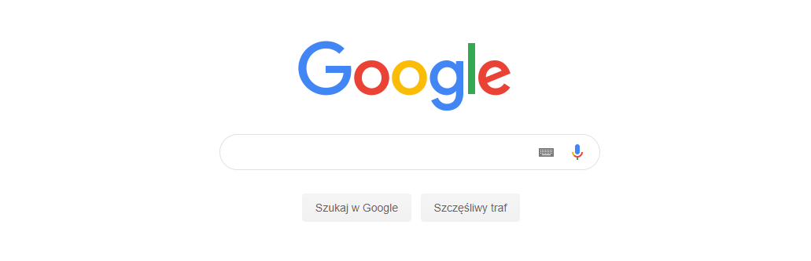

# Antywindykacja

## Spis treści
* [Technologie](#technologie)
* [O programie](#o-programie)
* [Konfiguracja](#konfiguracja)
* [Uruchomienie](#uruchomienie)
* [Działanie programu](#działanie-programu)
* [Licencja](#licencja)

## Technologie
* .NET Core 2.2.150
* Selenium 3.141.0

## O programie
* Program korzysta z przeglądarki [Google Chrome](https://www.google.com/intl/en/chrome/)
* Aby program działał poprawnie musimy się upewnić, że w plikach programu znajduje się `../chromedriver/chromedriver.exe`, w przypadku jego braku plik [ChromeDriver.exe](https://chromedriver.chromium.org/downloads) można pobrać ze strony 
* Program działa prawidłowo tylko dla adresów IP proxy HTTP

## Konfiguracja
Przed uruchomieniem programu powinniśmy sprawdzić czy jest on dobrze skonfigurowany. Bardzo ważne jest podanie godzin, w których program powinien działać oraz wpisanie odpowiedniej frazy do wyszukania w google i tytułu reklamy.
Wszystko robimy w pliku o nazwie `SeleniumChrome.dll.config`
* Dodawanie frazy: Wyszukujemy `<add key="Phrase" value=""/>`, gdzie w `value=""` podajemy naszą frazę. 
Przykład: `<add key="Phrase" value="moja fraza"/>`
* Dodawanie tytułu: Wyszukujemy `<add key="Title" value=""/>`, gdzie w `value=""` podajemy tytuł reklamy. 
Przykład: `<add key="Title" value="mój tytuł"/>`
* Ustawienie godziny od której działa program: Wyszukujemy `<add key="HourFrom" value=""/>`, gdzie w `value=""` podajemy pełną godzinę. Należy pamiętać o poprawnym formacie godziny z przedziału 0-23. 
Przykład: `<add key="HourFrom" value="8"/>`
* Ustawienie godziny do której działa program: Wyszukujemy `<add key="HourTo" value=""/>`, gdzie w `value=""` podajemy pełną godzinę. Należy pamiętać o poprawnym formacie godziny z przedziału 0-23. 
Przykład: `<add key="HourTo" value="16"/>`
* Dodawanie adresów IP proxy HTTP: Aby dodać adres IP to należy wpisać w sekcji <Addresses> `<add key="" value=""></add>`, gdzie w `key=""` wpisujemy nasz adres IP z proxy. 
Przykład: `<add key="192.166.219.46:3128" value=""></add>`
* Po dokonaniu zmian należy zapisać plik.

## Uruchomienie
* Otwieramy konsolę
* Przez użycie komendy `cd` przechodzimy do folderu przez podanie ścieżki gdzie znajdują się pliki z programu np. `cd dokumenty/folder1/folder2`
* Uruchomić program wpisujemy komendę `dotnet SeleniumChrome.dll` , lecz musimy pamiętać żeby znajdować się w odpowiednim folderze

## Działanie programu
Po uruchomieniu program wybiera adres IP z podanych w pliku konfiguracyjnym (`SeleniumChrome.dll.config`) na podstawie którego łączy się z przeglądarką. Następnie zostaje uruchomiony Google Chrome i jest wczytana strona google.pl  

gdzie zostaje wpisana podana przez nas fraza. Po wczytaniu frazy jest szukana reklama z podanym przez nas tytułem. Gdy tytuł zostanie znaleziony to program załaduje nam stronę tej reklamy. Później program zamyka przeglądarkę i losuje kolejny adres IP z podanych po czym zaczyna powtarzać wszystkie procesy co na początku lecz już z innym adresem IP. Program tak będzie działał w kółko aż do godziny, która zakończy jego działanie i została podana w pliku konfiguracyjnym. 
Jeżeli program nie znajdzie wybranego tytułu lub będzie miał problem z połączeniem to następują ponowne próby wyszukania lub połączenia. Jeżeli problem dalej będzie występował to nastąpią dwie kolejne próby w odstępie 60 sekund, w których program trzy razy będzie próbował sie połączyć, a gdy one nie przyniosą rezultatów, to przeglądarka jest zamykana i następuje próba połączenia z nowym losowo wybranym adresem IP.

## Licencja
MIT